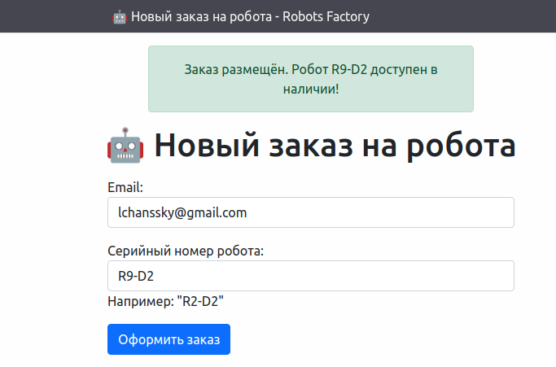

# Task 1. От технического специалиста компании.
Создать API-endpoint, принимающий и обрабатывающий информацию в формате JSON. 
В результате web-запроса на этот endpoint, в базе данных появляется запись 
отражающая информацию о произведенном на заводе роботе. 

_**Примечание от старшего технического специалиста**_: 
Дополнительно предусмотреть валидацию входных данных, на соответствие существующим в системе моделям.

Пример входных данных:

```{"model":"R2","version":"D2","created":"2022-12-31 23:59:59"}```

```{"model":"13","version":"XS","created":"2023-01-01 00:00:00"}```

```{"model":"X5","version":"LT","created":"2023-01-01 00:00:01"}```

## _Решение_
Находится в файлах `robots/views.py`, `robots/models.py`.   
Адрес эндпоинта (запрос POST): http://127.0.0.1:8000/robots/api/v1/create


# Task 2. От директора компании
**User Story**: Я как директор хочу иметь возможность скачать по прямой ссылке Excel-файл со сводкой по суммарным показателям производства роботов за последнюю неделю. 

_**Примечание от менеджера**_. Файл должен включать в себя несколько страниц, на каждой из которых представлена информация об одной модели, но с детализацией по версии. 

Схематично для случая с моделью "R2":

```
 __________________________________
|Модель|Версия|Количество за неделю|
 __________________________________
|  R2  |  D2  |       32           |
 __________________________________
|  R2  |  A1  |       41           |
              ...
              ... 
              ...
|  R2  |  С8  |       99           |
              ...  
```

## _Решение_
Находится в файлах `robots/views.py`, `robots/reports.py`.   
Адрес для скачивания файла: http://127.0.0.1:8000/robots/weekly_report

# Task 3. От клиента компании.
**Job story**: Если я оставляю заказ на робота, и его нет в наличии, я готов подождать до момента появления робота. После чего, пожалуйста пришлите мне письмо.

_**Примечание от менеджера**_: Письмо должно быть следующего формата
```
Добрый день!
Недавно вы интересовались нашим роботом модели X, версии Y. 
Этот робот теперь в наличии. Если вам подходит этот вариант - пожалуйста, свяжитесь с нами
```
где Х и Y это соответственно модель и версия робота.

_**Примечание от старшего технического специалиста**_: Постарайтесь не переопределять встроенные методы модели. Также стремитесь не смешивать контексты обработки данных и бизнес-логику. Рекомендуется использовать механизм сигналов предусмотренный в фреймворке.


## _Решение_
Находится в файлах `orders/views.py`, `orders/models.py`  
Темплейт страницы находится в `orders/templates/orders/order_new.html`.  
Форма находится в `orders/forms.py`. Использовал не ModelForm, а обычную, чтобы при создании заказа создавать нового Customer, если его ещё нет в базе данных.
Адрес для создания заказа: http://127.0.0.1:8000/orders/new


